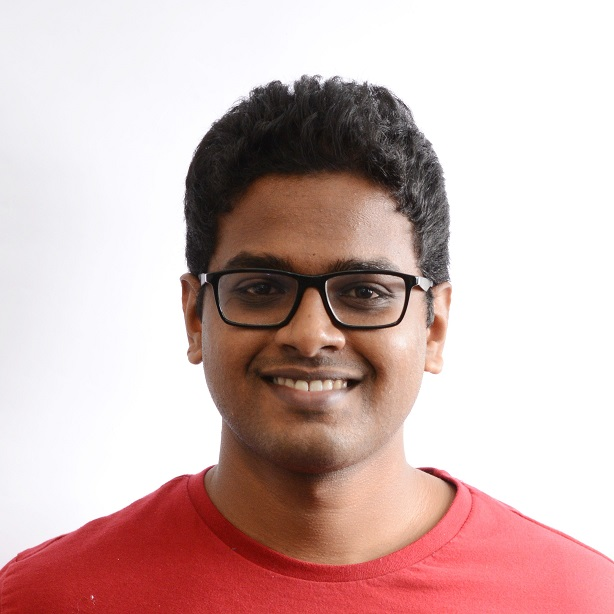

I'm a Ph.D. candidate at at the Diagnostic Image Analysis Group in Radboudumc in Nijmegen, The Netherlands. I'm working on lung nodule characterization under the supervision of Prof. Dr. Bram van Ginneken and Dr. Colin Jacobs.

My research interests revolve around medical image analysis and deep learning with an emphasis on temporal analysis. I obtained my Bachelor's and Master's degrees in the Engineering Design department at IIT Madras, in 2016, with a specialization in Biomedical Design. My Master's thesis was on brain tumor segmentation using deep learning. I worked at the MiRL lab under the supervision of Dr. Ganapathy Krishnamurthi. 
After my graduation, I worked at Predible Health as an AI Scientist and developed deep learning solutions for medical image analysis for the Indian healthcare system.

